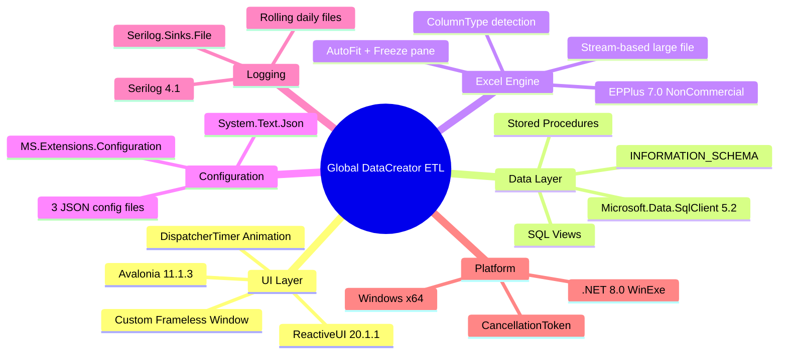
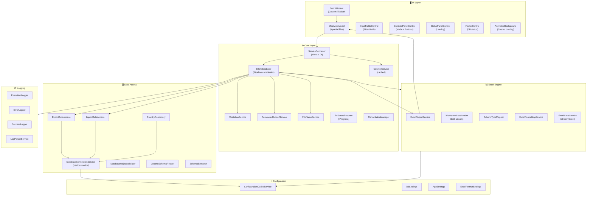
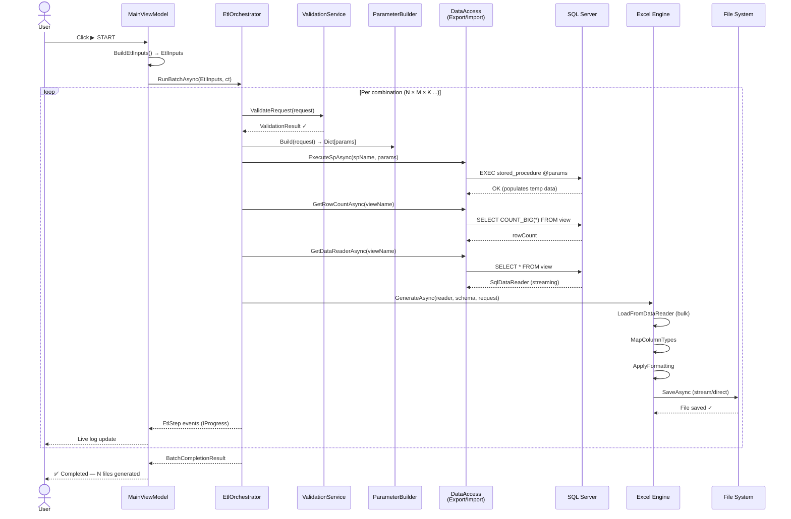
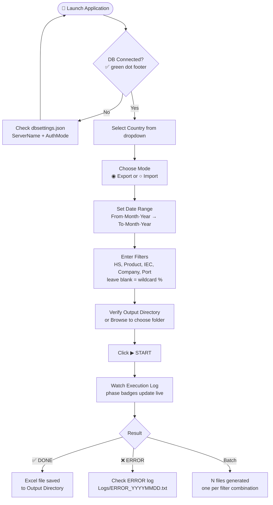
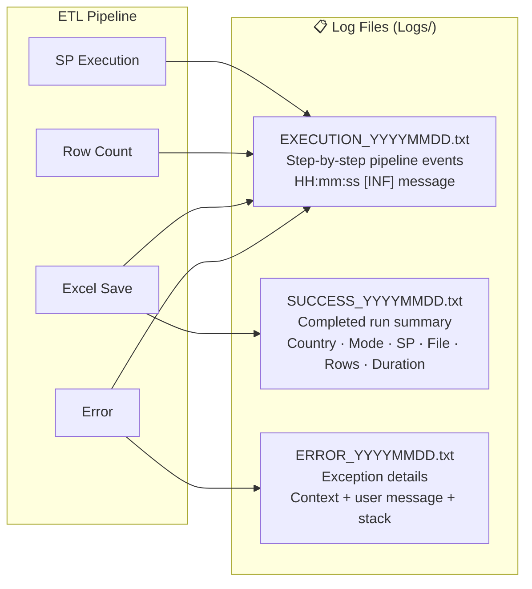

<div align="center">


# GLOBAL\_DATACREATOR\_ETL

**Enterprise-grade ETL Pipeline · Trade Analytics · Excel Report Generation**

---

[](https://dotnet.microsoft.com/)
[](https://avaloniaui.net/)
[](https://reactiveui.net/)
[](https://epplussoftware.com/)
[](https://www.microsoft.com/sql-server)
[](https://www.microsoft.com/windows)
[](https://github.com)

---

*A full-featured desktop ETL application for extracting global trade data from SQL Server, processing Import/Export pipelines via stored procedures, and generating professionally formatted multi-sheet Excel reports — all from a polished, animated dark-themed UI.*

</div>

---

## Table of Contents

- [Overview](#overview)
- [Key Features](#key-features)
- [UI Preview](#ui-preview)
- [Tech Stack](#tech-stack)
- [Architecture](#architecture)
- [ETL Pipeline](#etl-pipeline)
- [Data Flow](#data-flow)
- [Project Structure](#project-structure)
- [Configuration](#configuration)
- [Setup & Installation](#setup--installation)
- [Quick Start](#quick-start)
- [Filter Parameters Reference](#filter-parameters-reference)
- [Logging System](#logging-system)
- [Log Phase Reference](#log-phase-reference)
- [Excel Output Format](#excel-output-format)

---

## Overview

**Global DataCreator ETL** is a Windows desktop application that automates the extraction, transformation, and Excel-export of international trade data sourced from a SQL Server database.

It supports **multi-value batch processing** — a single execution can fan out across every combination of HS codes, products, IEC codes, ports, and company names — generating one properly named Excel file per combination. The entire pipeline is observable in real-time through a live-updating Execution Log panel with per-phase color-coded badges.

```
SQL Server  ──►  Stored Procedure (SP)  ──►  View Query  ──►  Excel Workbook  ──►  Output Folder
```

---

## Key Features

| Feature | Description |
|---|---|
| **Dual-mode ETL** | Separate Import (`@ImpCmp`) and Export (`@ExpCmp`) pipelines with distinct SPs and views per country |
| **Batch execution** | Cartesian-product expansion of multi-value comma-separated filter inputs — `N × M × K` files in one click |
| **Real-time log panel** | Phase-tagged live execution log with coloured badges, elapsed timer, and row counter |
| **Professional Excel output** | Times New Roman body font, Calibri headers, date/numeric/text column formats, freeze pane, auto-fit, thin borders |
| **Smart file naming** | Auto-generates `Country_Filters_MonthRangeEXP.xlsx`; user override supported; collision-safe with timestamp suffix |
| **Cosmic animated background** | 30fps canvas animation — nebula orbs, 90 twinkling stars, shooting star streaks — rendered at 13% opacity behind all cards |
| **Custom title bar** | Fully frameless window with branded logo, gradient header, and Minimize / Maximize / Close |
| **DB health monitoring** | Background thread pings SQL Server every N minutes; footer shows live server + connection + latency |
| **Structured logging** | Three separate rolling-daily Serilog files: `EXECUTION_*.txt`, `SUCCESS_*.txt`, `ERROR_*.txt` |
| **Cancellation support** | `CancellationToken` threaded through every async step; partial files cleaned up on cancel |
| **Config-driven** | Three JSON files control DB, app, and Excel formatting — hot-invalidatable cache |

---

## UI Preview

```
┌──────────────────────────────────────────────────────────────────────┐
│  [Logo]  Global DataCreator ETL                     [ _ ][ □ ][ × ] │
│          Trade Data Extraction & Excel Generation                     │
├──────────────────────────────────────────────────────────────────────┤
│  ╔═══════════════════════════════════════════════════╗               │
│  ║  🔽 FILTER PARAMETERS                             ║               │
│  ║─────────────────────────────────────────────────║               │
│  ║  Date From  │  Date To   │  HS Code               ║               │
│  ║  Product    │  IEC Code  │  Company               ║               │
│  ║  Foreign CC │  Fgn Name  │  Port                  ║               │
│  ║  Country ▼  │  File Name │  Output Dir  [Browse]  ║               │
│  ╚═══════════════════════════════════════════════════╝               │
│                                                                      │
│  ╔══════════════════════════════╗  ╔══════════════════════════╗      │
│  ║  ⚡ EXECUTION LOG            ║  ║  ⚙ EXECUTION CONTROLS    ║      │
│  ║──────────────────────────── ║  ║──────────────────────────║      │
│  ║  ● Idle · INIT · 0.0s       ║  ║  Mode: ◉ Export  ○ Import║      │
│  ║  ──────────────────────     ║  ║  VIEW  ──────────────────║      │
│  ║  TIME  │ STAGE  │ DETAILS   ║  ║  SP    ──────────────────║      │
│  ║  10:01 │ [INIT] │ Loading…  ║  ║──────────────────────────║      │
│  ║  10:01 │ [DB  ] │ Connected ║  ║  [▶ START]               ║      │
│  ║  10:01 │ [DONE] │ 1240 rows ║  ║  [■ CANCEL]              ║      │
│  ║        │        │           ║  ║  [↺ RESET ]              ║      │
│  ╚══════════════════════════════╝  ╚══════════════════════════╝      │
│                                                                      │
├──────────────────────────────────────────────────────────────────────┤
│  [Logo]  © 2026 Global DataCreator ETL v1.0.0     ● Matrix,1434     │
└──────────────────────────────────────────────────────────────────────┘
```

---

## Tech Stack



| Layer | Technology | Version | Purpose |
|---|---|---|---|
| **UI Framework** | Avalonia | 11.1.3 | Cross-layout XAML desktop UI |
| **UI Pattern** | ReactiveUI | 20.1.1 | MVVM reactive bindings |
| **Excel** | EPPlus | 7.0.9 | Workbook generation & formatting |
| **Database** | Microsoft.Data.SqlClient | 5.2.2 | SQL Server connectivity |
| **Logging** | Serilog + Sinks.File | 4.1 / 6.0 | Structured rolling log files |
| **Config** | MS.Extensions.Configuration | 8.0 | JSON config binding |
| **Runtime** | .NET | 8.0 Windows x64 | Host platform |

---

## Architecture

The application follows a strict **layered architecture** with manual dependency injection via `ServiceContainer`.



---

## ETL Pipeline

Each execution follows a deterministic 9-step pipeline. Multi-value filters expand into a Cartesian batch — each combination runs the full pipeline independently.



---

## Data Flow

```mermaid
flowchart LR
    subgraph INPUT["📥 Input"]
        UI["UI Filter Form\nCountry · Mode\nHS · IEC · Port\nDate Range"]
    end

    subgraph EXPAND["🔀 Batch Expansion"]
        CART["Cartesian Product\nN×M×K combinations"]
    end

    subgraph SQLSRV["🗄️ SQL Server\n(Matrix,1434 / Process)"]
        MST["dbo.mst_country\n(computed SP/View names)"]
        SP["Stored Procedure\nEXP_BOT_* / IMP_BOT_*"]
        VIEW["SQL View\nvw_EXP_* / vw_IMP_*"]
    end

    subgraph EXCEL["📊 Excel Engine"]
        LOAD["Bulk Stream\nLoadFromDataReader"]
        MAP["Type Mapping\nDate·Numeric·Text"]
        FMT["Format & Style\nHeaders·Borders·AutoFit"]
        SAVE["Save\n≤50K: MemoryStream\n>50K: FileStream"]
    end

    subgraph OUTPUT["📤 Output"]
        FILE["Country_Filters_MMMYY_EXP.xlsx\nOutput Directory"]
        LOG["Log Files\nEXECUTION · SUCCESS · ERROR"]
    end

    UI --> EXPAND
    EXPAND --> MST
    MST --> SP
    SP --> VIEW
    VIEW --> LOAD
    LOAD --> MAP
    MAP --> FMT
    FMT --> SAVE
    SAVE --> FILE
    SAVE --> LOG
```



---

## Project Structure

```
Global_DataCreator_ETL/
├── src/
│   └── GlobalDataCreatorETL/
│       ├── App.axaml(.cs)                 # Application bootstrap + DI wiring
│       ├── Program.cs                     # Entry point (STAThread)
│       │
│       ├── Asset/                         # Brand assets (registered as AvaloniaResource)
│       │   ├── Logo.png                   # Full brand logo (title bar + footer)
│       │   ├── favicon.ico                # Window taskbar icon
│       │   └── favicon_io/               # Full favicon set (16,32,192,512px)
│       │
│       ├── Config/                        # Runtime configuration (CopyToOutput)
│       │   ├── appsettings.json           # Output/log paths, row limits
│       │   ├── dbsettings.json            # Server, auth, timeouts
│       │   └── excelformatting.json       # Excel fonts, colors, formats
│       │
│       ├── Core/
│       │   ├── Cancellation/
│       │   │   └── CancellationManager.cs # Thread-safe CTS wrapper
│       │   ├── Configuration/
│       │   │   ├── ConfigurationCacheService.cs
│       │   │   └── Models/               # AppSettings, DbSettings, ExcelFormatSettings
│       │   ├── Database/
│       │   │   ├── DatabaseConnectionService.cs  # Health monitoring, pause/resume
│       │   │   ├── DatabaseObjectValidator.cs    # SP/View existence checks
│       │   │   ├── ColumnSchemaReader.cs          # INFORMATION_SCHEMA reader
│       │   │   └── SchemaExtractor.cs             # Live SqlDataReader schema
│       │   ├── DataAccess/
│       │   │   ├── CountryRepository.cs           # dbo.mst_country queries
│       │   │   ├── ExportDataAccess.cs             # Export SP + View data
│       │   │   └── ImportDataAccess.cs             # Import SP + View data
│       │   ├── Models/
│       │   │   ├── ColumnInfo.cs / ColumnTypeMap.cs
│       │   │   ├── CountryDto.cs / CountryMeta.cs
│       │   │   ├── EtlInputs.cs / EtlRequest.cs / EtlStep.cs
│       │   │   ├── CompletionResult.cs / BatchCompletionResult.cs
│       │   │   └── ValidationResult.cs
│       │   └── Services/
│       │       ├── EtlOrchestrator.cs             # ⭐ Central pipeline coordinator
│       │       ├── EtlStatusReporter.cs           # IProgress<EtlStep> bridge
│       │       ├── CountryService.cs              # Cached country list
│       │       ├── ValidationService.cs           # Pre-execution validation
│       │       ├── ParameterBuilderService.cs     # SP parameter dictionary
│       │       ├── FileNameService.cs             # Output filename resolution
│       │       └── ServiceContainer.cs            # Manual DI container
│       │
│       ├── Features/
│       │   ├── Excel/
│       │   │   ├── ExcelReportService.cs          # Top-level Excel coordinator
│       │   │   ├── WorksheetDataLoader.cs         # Bulk SqlDataReader → worksheet
│       │   │   ├── ColumnTypeMapper.cs            # SQL type → Date/Num/Text buckets
│       │   │   ├── ExcelFormattingService.cs      # Headers, borders, formats, autofit
│       │   │   └── ExcelSaveService.cs            # MemoryStream vs FileInfo save
│       │   └── Logging/
│       │       ├── ExecutionLogger.cs             # EXECUTION_YYYYMMDD.txt
│       │       ├── ErrorLogger.cs                 # ERROR_YYYYMMDD.txt
│       │       ├── SuccessLogger.cs               # SUCCESS_YYYYMMDD.txt
│       │       └── LogParserService.cs            # Reads latest log for UI summary
│       │
│       └── UI/
│           ├── Assets/Styles/
│           │   └── GlobalStyles.axaml             # Design tokens + all style classes
│           ├── Converters/
│           │   ├── MonthIndexConverter.cs         # 1-based month ↔ 0-based ComboBox
│           │   └── StringEqualConverter.cs        # Mode radio button binding
│           ├── Helpers/
│           │   └── DateHelpers.cs                 # MonthNames + YearRange static
│           ├── Models/
│           │   ├── EtlFilter.cs                   # Reactive filter model (two-way bindings)
│           │   ├── ConnectionInfo.cs              # Immutable DB status snapshot
│           │   ├── SystemStatus.cs                # Enum + display extensions
│           │   └── LogEntry.cs                    # Log row + per-phase computed brushes
│           ├── ViewModels/
│           │   ├── MainViewModel.cs               # Root + event wiring
│           │   ├── MainViewModel.Properties.cs   # All reactive properties
│           │   ├── MainViewModel.Commands.cs      # ReactiveCommand declarations
│           │   ├── MainViewModel.CommandHandlers.cs  # Start/Cancel/Reset/Browse
│           │   ├── MainViewModel.Initialization.cs  # ConnectAndLoad flow
│           │   ├── MainViewModel.Validation.cs    # UI-layer validation
│           │   └── MainViewModel.MenuCommands.cs  # Config/Output folder openers
│           └── Views/
│               ├── MainWindow.axaml(.cs)          # Frameless window + layout
│               └── Controls/
│                   ├── InputFieldsControl.axaml(.cs)      # Filter form
│                   ├── ControlsPanelControl.axaml(.cs)    # Mode + Start/Cancel/Reset
│                   ├── StatusPanelControl.axaml(.cs)      # Live execution log
│                   ├── FooterControl.axaml(.cs)           # DB connection status bar
│                   └── AnimatedBackgroundControl.axaml(.cs) # Cosmic animation overlay
│
├── Logs/                                 # Runtime log output
│   ├── EXECUTION_YYYYMMDD.txt
│   ├── SUCCESS_YYYYMMDD.txt
│   └── ERROR_YYYYMMDD.txt
├── Output/                              # Generated Excel files
├── Execution_Blueprint.md
└── README.md
```

---

## Configuration

Three JSON files in `Config/` drive all runtime behaviour. They are copied to the output directory on build.

### `dbsettings.json`

```json
{
  "ServerName": "YourServer,Port",
  "DatabaseName": "YourDatabase",
  "AuthMode": "Windows",
  "CommandTimeoutSeconds": 3600,
  "ConnectionTimeoutSeconds": 5,
  "MonitoringIntervalMinutes": 10
}
```

| Key | Description |
|---|---|
| `ServerName` | SQL Server `host,port` or named instance |
| `DatabaseName` | Target database containing `dbo.mst_country` and trade SPs/views |
| `AuthMode` | `"Windows"` (integrated auth) or `"SqlAuth"` (requires `Username`/`Password`) |
| `CommandTimeoutSeconds` | Timeout for long-running SP executions (default: 3600) |
| `ConnectionTimeoutSeconds` | Initial connection timeout (default: 5) |
| `MonitoringIntervalMinutes` | DB health ping interval in minutes (default: 10) |

### `appsettings.json`

```json
{
  "OutputFilePath": "C:\\YourPath\\Output",
  "LogFilePath":    "C:\\YourPath\\Logs",
  "AppName":        "Global DataCreator ETL",
  "AppVersion":     "1.0.0",
  "LargeDatasetThreshold": 50000,
  "MaxExcelRows": 1048575
}
```

| Key | Description |
|---|---|
| `OutputFilePath` | Default directory pre-filled in the Output Directory field |
| `LogFilePath` | Directory for all three rolling Serilog log files |
| `LargeDatasetThreshold` | Rows above this threshold use `FileInfo` save (avoids OOM) |
| `MaxExcelRows` | Maximum rows per sheet — execution fails gracefully if exceeded |

### `excelformatting.json`

```json
{
  "FontName": "Times New Roman",
  "FontSize": 10,
  "HeaderFontName": "Calibri",
  "HeaderFontSize": 11,
  "HeaderBackgroundColor": "FCD5B4",
  "DateFormat": "dd-mmm-yy",
  "AutoFitColumns": true,
  "FreezeTopRow": true,
  "WrapText": false,
  "HeaderRowHeight": 20
}
```

---

## Setup & Installation

### Prerequisites

| Requirement | Version |
|---|---|
| Windows | 10/11 x64 |
| .NET Runtime | 8.0+ |
| SQL Server | 2016+ (any edition) |
| Visual Studio | 2022+ (optional, for development) |

### Database Requirements

The application expects the following schema in the target database:

```sql
-- Master country table with computed columns
dbo.mst_country (
    id          BIGINT,          -- Country ID
    CountryName NVARCHAR(100),
    Shortcode   VARCHAR(10),
    is_active   CHAR(1),         -- 'Y' / 'N'
    Import_View AS (...),        -- Computed: view name for imports
    Export_View AS (...),        -- Computed: view name for exports
    Import_SP   AS (...),        -- Computed: SP name for imports
    Export_SP   AS (...),        -- Computed: SP name for exports
    TableName   AS (...)         -- Computed: base table name
)
```

Each country's stored procedure accepts these parameters:

```sql
@fromMonth  INT,        -- YYYYMM format
@ToMonth    INT,        -- YYYYMM format
@hs         NVARCHAR,   -- HS code filter (% = all)
@prod       NVARCHAR,   -- Product filter
@Iec        NVARCHAR,   -- IEC code filter
@ExpCmp     NVARCHAR,   -- Exporter company (Export mode)
@ImpCmp     NVARCHAR,   -- Importer company (Import mode)
@forcount   NVARCHAR,   -- Foreign country code
@forname    NVARCHAR,   -- Foreign country name
@port       NVARCHAR    -- Port filter
```

### Build & Run

```bash
# Clone the repository
git clone https://github.com/your-org/Global_DataCreator_ETL.git
cd Global_DataCreator_ETL

# Restore and build
dotnet build src/GlobalDataCreatorETL/GlobalDataCreatorETL.csproj -c Release

# Update Config/dbsettings.json with your SQL Server details

# Run
dotnet run --project src/GlobalDataCreatorETL/GlobalDataCreatorETL.csproj -c Release
```

Or open `GlobalDataCreatorETL.sln` in Visual Studio 2022 and press **F5**.

---

## Quick Start



### Batch Mode Example

Multiple values can be entered comma-separated in any filter field:

```
HS Code:    8471, 8473, 8517
Product:    (leave blank → all)
IEC Code:   (leave blank → all)
```

This generates **3 files** — one for each HS code — each with the full dataset for that code across all products and IEC codes.

---

## Filter Parameters Reference

| Field | Binding | SP Parameter | Wildcard |
|---|---|---|---|
| From Month / Year | `Filter.FromMonth` + `Filter.FromYear` | `@fromMonth` (YYYYMM) | — (required) |
| To Month / Year | `Filter.ToMonth` + `Filter.ToYear` | `@ToMonth` (YYYYMM) | — (required) |
| HS Code | `Filter.HsCode` | `@hs` | blank → `%` |
| Product | `Filter.Product` | `@prod` | blank → `%` |
| IEC Code | `Filter.IecCode` | `@Iec` | blank → `%` |
| Company | `Filter.CompanyName` | `@ExpCmp` / `@ImpCmp` | blank → `%` |
| Foreign Country Code | `Filter.ForeignCountryCode` | `@forcount` | blank → `%` |
| Foreign Name | `Filter.ForeignName` | `@forname` | blank → `%` |
| Port | `Filter.Port` | `@port` | blank → `%` |

---

## Logging System

Three rolling-daily Serilog log files are written to the configured `LogFilePath`:



**Log format examples:**

```
# EXECUTION log
10:23:41 [INF] Connecting to SQL Server (Matrix,1434) — database: Process
10:23:42 [INF] Connection established — SQL Server online and responsive
10:23:42 [INF] Loading active countries from dbo.mst_country

# SUCCESS log
Country  : INDIA
Mode     : Export
SP       : SP_BOT_EXP_INDIA
View     : vw_EXP_INDIA
From     : 202401
To       : 202412
File     : INDIA_8471_JAN24-DEC24EXP.xlsx
Rows     : 12,450
Duration : 8.3s
```

---

## Log Phase Reference

Each step in the execution log carries a colour-coded badge:

| Phase Badge | Colour | Triggered by |
|---|---|---|
| `INIT` | Steel blue | Application startup |
| `DB` | Steel blue | Database connection events |
| `BATCH` | Steel blue | Batch job start/count |
| `PREPARING` | Indigo | Building SP parameters |
| `EXECUTING_SP` | Indigo | SP execution in progress |
| `SP_DONE` | Indigo | SP completed successfully |
| `COUNTING` | Cyan-teal | `COUNT_BIG(*)` query |
| `DATA` | Cyan-teal | View data reading |
| `SCHEMA` | Cyan-teal | Column schema extraction |
| `GENERATING_EXCEL` | Emerald | Excel workbook generation |
| `DONE` | Emerald | File saved, run complete |
| `NO_DATA` | Amber | Zero rows returned |
| `CANCELLED` | Amber | User cancelled |
| `VALIDATION` | Red | Input validation failure |
| `ERROR` | Red | Any unhandled exception |

---

## Excel Output Format

Generated workbooks follow a consistent professional template:

```
┌──────────────────────────────────────────────────────────────────┐
│  Col A   │ Col B   │ Date Col │ Numeric Col │ Text Col │ ...     │
│ ──────── │ ─────── │ ──────── │ ──────────  │ ──────── │         │  ← Calibri 11pt
│  Header  │ Header  │  Header  │   Header    │  Header  │         │  ← bg #FCD5B4
╠══════════╪═════════╪══════════╪═════════════╪══════════╪═════════╣  ← Freeze pane
│  data    │  data   │ 01-Jan-24│  1,234.56   │  text    │         │  ← TNR 10pt
│  data    │  data   │ 15-Mar-24│  9,876.00   │  text    │         │
│   ...    │   ...   │   ...    │     ...     │   ...    │         │
└──────────────────────────────────────────────────────────────────┘
   AutoFit widths  │  Thin borders  │  dd-mmm-yy  │  #,##0.##
```

| Attribute | Value |
|---|---|
| Body font | Times New Roman 10pt Black |
| Header font | Calibri 11pt, Bold, Centered |
| Header background | `#FCD5B4` (peach/salmon) |
| Date format | `dd-mmm-yy` |
| Numeric format | `#,##0.##` |
| Text format | `@` (literal) |
| Column widths | Auto-fit (sample-row limited for large datasets) |
| Top row | Frozen |
| Borders | Thin, data range only |
| Worksheet name | `{CountryName} {Mode}` (max 31 chars) |

---

## License

This project uses **EPPlus** under the [PolyForm Noncommercial License](https://polyformproject.org/licenses/noncommercial/1.0.0/). Other dependencies retain their own licenses.

---

<div align="center">


**Built with ❤️ using .NET 8 · Avalonia · ReactiveUI · EPPlus**

*Global DataCreator ETL — Turning raw trade data into actionable intelligence*

</div>
