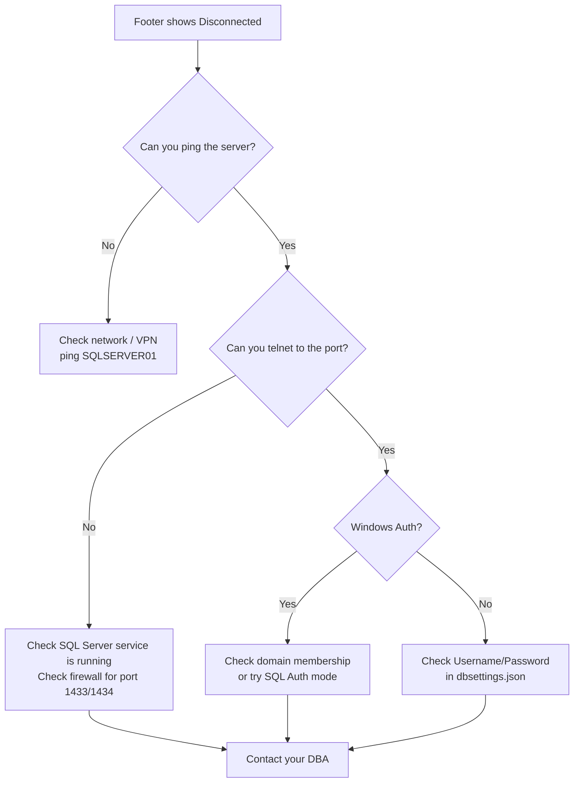

<div align="center">


# Installation Guide

**Global DataCreator ETL — v1.0.0**

*Complete setup walkthrough from zero to first successful extraction*

</div>

---

## Table of Contents

- [System Requirements](#system-requirements)
- [Pre-Installation Checklist](#pre-installation-checklist)
- [Step 1 — Install .NET 8 Runtime](#step-1--install-net-8-runtime)
- [Step 2 — Prepare the Application](#step-2--prepare-the-application)
- [Step 3 — Configure the Database Connection](#step-3--configure-the-database-connection)
- [Step 4 — Configure Application Settings](#step-4--configure-application-settings)
- [Step 5 — Prepare Output & Log Directories](#step-5--prepare-output--log-directories)
- [Step 6 — Verify Database Schema](#step-6--verify-database-schema)
- [Step 7 — First Launch Verification](#step-7--first-launch-verification)
- [Updating the Application](#updating-the-application)
- [Uninstalling](#uninstalling)
- [Troubleshooting Installation](#troubleshooting-installation)

---

## System Requirements

### Minimum Hardware

| Component | Minimum | Recommended |
|---|---|---|
| **CPU** | 2 cores, 2.0 GHz | 4 cores, 2.5 GHz+ |
| **RAM** | 4 GB | 8 GB |
| **Disk Space** | 500 MB (app + .NET) | 10 GB+ (for output Excel files) |
| **Display** | 1280 × 720 | 1920 × 1080 |

### Operating System

| OS | Support |
|---|---|
| Windows 11 (x64) | ✅ Fully supported |
| Windows 10 (x64) build 1903+ | ✅ Fully supported |
| Windows 10 (x86) | ❌ Not supported — x64 only |
| Windows Server 2019+ | ✅ Supported |
| macOS / Linux | ❌ Not supported (WinExe target) |

### Runtime Dependencies

| Dependency | Version | Notes |
|---|---|---|
| **.NET Runtime** | 8.0+ | Windows Desktop runtime required |
| **Visual C++ Redistributable** | 2019+ | Usually pre-installed on modern Windows |
| **SQL Server** | 2016+ | Network access required |

### Network Requirements

| Requirement | Details |
|---|---|
| SQL Server connectivity | TCP/IP access to `ServerName,Port` |
| Windows Authentication | Domain membership OR local SQL auth |
| Firewall | SQL Server port (default 1433) must be open |

---

## Pre-Installation Checklist

Work through this checklist before beginning installation:

```
☐  Windows 10/11 x64 confirmed
☐  .NET 8 Desktop Runtime installed (or will install in Step 1)
☐  SQL Server hostname and port known   (e.g.  Matrix,1434)
☐  Target database name known           (e.g.  Process)
☐  Authentication method decided        (Windows Auth or SQL Auth)
☐  SQL Server credentials available (if SQL Auth)
☐  dbo.mst_country table exists with computed columns
☐  At least one country's SP and View deployed in the database
☐  Output folder path decided            (e.g.  D:\TradeData\Output)
☐  Logs folder path decided              (e.g.  D:\TradeData\Logs)
☐  Write permission on both folders confirmed
```

---

## Step 1 — Install .NET 8 Runtime

### Check if .NET 8 is already installed

Open **Command Prompt** or **PowerShell** and run:

```powershell
dotnet --list-runtimes
```

Look for a line containing `Microsoft.WindowsDesktop.App 8.x.x`. If found, skip to Step 2.

### Download and install

1. Navigate to: [https://dotnet.microsoft.com/download/dotnet/8.0](https://dotnet.microsoft.com/download/dotnet/8.0)
2. Under **"Run desktop apps"**, click **Download x64**
3. Run the installer: `windowsdesktop-runtime-8.x.x-win-x64.exe`
4. Follow the prompts — no custom options needed
5. Verify installation:

```powershell
dotnet --version
# Should print: 8.x.x
```

---

## Step 2 — Prepare the Application

### Option A — From a build artifact (ZIP)

1. Download or receive `GlobalDataCreatorETL_v1.0.0.zip`
2. Right-click the ZIP → **Properties** → check **Unblock** (if present) → **OK**
3. Extract to a permanent location, e.g.:
   ```
   C:\Apps\GlobalDataCreatorETL\
   ```
4. Confirm the extracted structure:
   ```
   GlobalDataCreatorETL\
   ├── GlobalDataCreatorETL.exe     ← Main executable
   ├── GlobalDataCreatorETL.dll
   ├── Config\
   │   ├── appsettings.json
   │   ├── dbsettings.json
   │   └── excelformatting.json
   └── (other runtime files)
   ```

### Option B — Build from source

```powershell
# Clone
git clone https://github.com/your-org/Global_DataCreator_ETL.git
cd Global_DataCreator_ETL

# Build Release
dotnet publish src/GlobalDataCreatorETL/GlobalDataCreatorETL.csproj `
    -c Release `
    -r win-x64 `
    --self-contained false `
    -o publish/

# Executable will be at:
# publish/GlobalDataCreatorETL.exe
```

> **Tip:** Add `--self-contained true` to bundle the .NET runtime inside the publish folder — useful for machines without .NET installed.

---

## Step 3 — Configure the Database Connection

Open `Config\dbsettings.json` in any text editor:

```json
{
  "ServerName":                "YOUR_SERVER,PORT",
  "DatabaseName":              "YOUR_DATABASE",
  "AuthMode":                  "Windows",
  "CommandTimeoutSeconds":     3600,
  "ConnectionTimeoutSeconds":  5,
  "MonitoringIntervalMinutes": 10
}
```

### Field Reference

| Field | Required | Example | Notes |
|---|---|---|---|
| `ServerName` | ✅ | `Matrix,1434` | Use `host,port` for non-default ports |
| `DatabaseName` | ✅ | `Process` | Case-insensitive database name |
| `AuthMode` | ✅ | `Windows` | `"Windows"` or `"SqlAuth"` |
| `Username` | Conditional | `etl_user` | Required only if `AuthMode = "SqlAuth"` |
| `Password` | Conditional | `s3cr3t!` | Required only if `AuthMode = "SqlAuth"` |
| `CommandTimeoutSeconds` | ✅ | `3600` | Increase for large SP executions |
| `ConnectionTimeoutSeconds` | ✅ | `5` | Health check ping timeout |
| `MonitoringIntervalMinutes` | ✅ | `10` | Background DB health check interval |

### Windows Authentication (Recommended)

```json
{
  "ServerName":   "SQLSERVER01,1433",
  "DatabaseName": "TradeDB",
  "AuthMode":     "Windows"
}
```

### SQL Server Authentication

```json
{
  "ServerName":   "SQLSERVER01,1433",
  "DatabaseName": "TradeDB",
  "AuthMode":     "SqlAuth",
  "Username":     "etl_user",
  "Password":     "YourSecurePassword123!"
}
```

> ⚠️ **Security note:** Store credentials securely. Consider using Windows Auth wherever possible. Do not commit `dbsettings.json` containing SQL Auth passwords to source control.

---

## Step 4 — Configure Application Settings

Open `Config\appsettings.json`:

```json
{
  "OutputFilePath":           "D:\\TradeData\\Output",
  "LogFilePath":              "D:\\TradeData\\Logs",
  "AppName":                  "Global DataCreator ETL",
  "AppVersion":               "1.0.0",
  "LargeDatasetThreshold":    50000,
  "MaxExcelRows":             1048575
}
```

| Field | Description | Guidance |
|---|---|---|
| `OutputFilePath` | Default directory pre-filled in the UI | Use a drive with adequate free space |
| `LogFilePath` | Where `EXECUTION_*.txt`, `SUCCESS_*.txt`, `ERROR_*.txt` are written | Separate from the output if on a busy drive |
| `LargeDatasetThreshold` | Rows above this use direct-to-disk file writing | Lower if you encounter out-of-memory errors |
| `MaxExcelRows` | Hard cap on rows per file (Excel limit is 1,048,576) | Leave as default |

> ℹ️ Use **double backslashes** `\\` in JSON paths, or forward slashes `/` — both work.

---

## Step 5 — Prepare Output & Log Directories

Create the directories configured in `appsettings.json` if they don't already exist:

```powershell
# Replace with your configured paths
New-Item -ItemType Directory -Force -Path "D:\TradeData\Output"
New-Item -ItemType Directory -Force -Path "D:\TradeData\Logs"
```

**Verify write access:**

```powershell
echo "write test" > "D:\TradeData\Output\test.txt"
Remove-Item "D:\TradeData\Output\test.txt"
echo "write test" > "D:\TradeData\Logs\test.txt"
Remove-Item "D:\TradeData\Logs\test.txt"
# No errors = write access confirmed
```

> ⚠️ The application will fail to start its logging subsystem if `LogFilePath` does not exist or is not writable at startup.

---

## Step 6 — Verify Database Schema

Connect to your SQL Server and run these validation queries:

```sql
-- 1. Confirm mst_country table exists and has active entries
SELECT TOP 5
    id, CountryName, Shortcode,
    Import_View, Export_View,
    Import_SP,   Export_SP
FROM dbo.mst_country
WHERE is_active = 'Y'
ORDER BY CountryName;

-- 2. Confirm SP exists for a test country (replace with actual SP name)
SELECT ROUTINE_NAME, ROUTINE_TYPE
FROM INFORMATION_SCHEMA.ROUTINES
WHERE ROUTINE_TYPE = 'PROCEDURE'
  AND ROUTINE_NAME LIKE '%BOT%'
ORDER BY ROUTINE_NAME;

-- 3. Confirm View exists for a test country (replace with actual View name)
SELECT TABLE_NAME
FROM INFORMATION_SCHEMA.VIEWS
WHERE TABLE_NAME LIKE 'vw_%'
ORDER BY TABLE_NAME;
```

If Query 1 returns rows and Queries 2 & 3 return matching entries for your countries, the schema is ready.

---

## Step 7 — First Launch Verification

1. Double-click `GlobalDataCreatorETL.exe`
2. The window should open and after ~2 seconds:

```
✅ Expected footer:  ● Matrix,1434  |  Process  |  Connected (42ms)
❌ Problem footer:   ○ Matrix,1434  |  Process  |  Disconnected
```

3. The Execution Log panel should show:

```
TIME    STAGE    DETAILS
10:00   [INIT]   Starting Global DataCreator ETL v1.0.0
10:00   [DB  ]   Connecting to SQL Server (Matrix,1434) — database: Process
10:00   [DB  ]   Connection established — SQL Server online and responsive
10:00   [INIT]   Loading active countries from dbo.mst_country
10:00   [INIT]   Countries loaded — 45 active countries available
```

4. The **Country** dropdown should be populated.
5. **VIEW** and **STORED PROCEDURE** fields should show values after selecting a country.

**Installation is complete!** Proceed to the [User Guide](USER_GUIDE.md).

---

## Updating the Application

### Config-preserving update

```powershell
# 1. Back up your current config
Copy-Item "C:\Apps\GlobalDataCreatorETL\Config" `
          "C:\Apps\GlobalDataCreatorETL\Config_backup" -Recurse

# 2. Extract new version over the existing folder
# (or to a new folder, then copy Config\ across)
Expand-Archive "GlobalDataCreatorETL_v1.x.x.zip" `
               "C:\Apps\GlobalDataCreatorETL\" -Force

# 3. If config schema changed, merge manually from backup
# Otherwise the backed-up config is still valid
```

> ⚠️ Never overwrite `Config\` during an update without first reviewing changelog notes for config changes.

---

## Uninstalling

The application writes to three locations. To fully remove it:

```powershell
# 1. Remove the application folder
Remove-Item "C:\Apps\GlobalDataCreatorETL" -Recurse -Force

# 2. Remove output files (optional — keep if you want the Excel files)
Remove-Item "D:\TradeData\Output" -Recurse -Force

# 3. Remove log files
Remove-Item "D:\TradeData\Logs" -Recurse -Force
```

No registry entries or system hooks are created by this application.

---

## Troubleshooting Installation

### Application won't start — "You must install .NET Desktop Runtime 8"

**Fix:** Install the .NET 8 Desktop Runtime from [https://dotnet.microsoft.com/download/dotnet/8.0](https://dotnet.microsoft.com/download/dotnet/8.0). Download the **Windows Desktop Runtime x64** variant.

---

### Footer shows "Disconnected" immediately



---

### Country dropdown is empty after connection

**Cause:** Query against `dbo.mst_country WHERE is_active = 'Y'` returned no rows.

**Fix:** Run `SELECT COUNT(*) FROM dbo.mst_country WHERE is_active = 'Y'` in SSMS. If 0, update rows: `UPDATE dbo.mst_country SET is_active = 'Y' WHERE ...`

---

### "Access to path is denied" error when saving Excel

**Cause:** The configured `OutputFilePath` directory does not exist or the current Windows user lacks write access.

**Fix:**
1. Verify the directory exists: `Test-Path "D:\TradeData\Output"`
2. Ensure the user running the app has **Write** permission on the folder
3. Or use the **Browse** button to select a different output folder

---

### Application opens but UI is blank / all black

**Cause:** Rare GPU/DirectX rendering issue with Avalonia.

**Fix:** Set the environment variable before launching:

```powershell
$env:AVALONIA_RENDERING = "software"
.\GlobalDataCreatorETL.exe
```

Or create a shortcut with target: `cmd /c "set AVALONIA_RENDERING=software && GlobalDataCreatorETL.exe"`

---

<div align="center">

**Need more help?** Open an issue at the project repository or consult the [Usage Manual](USAGE_MANUAL.md).

</div>
