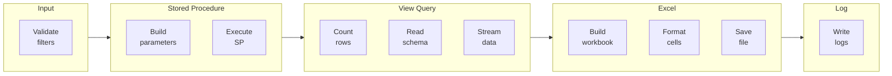
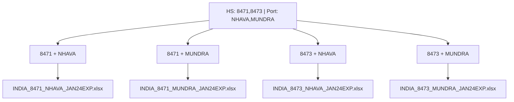
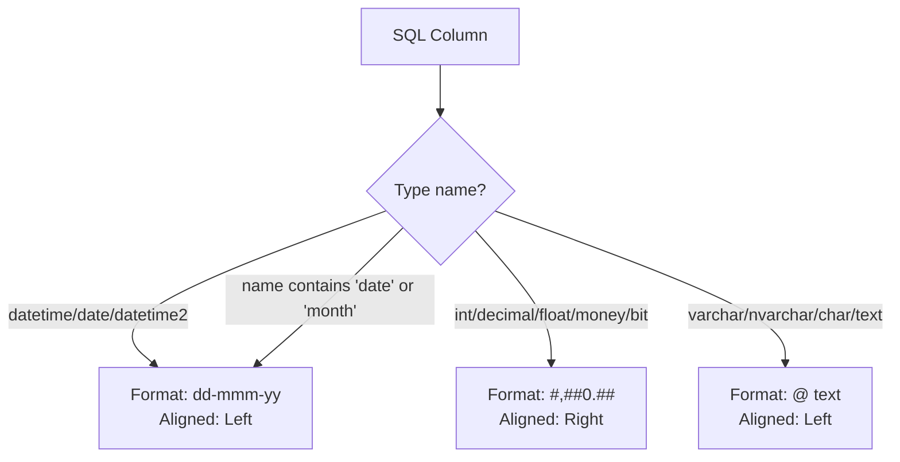
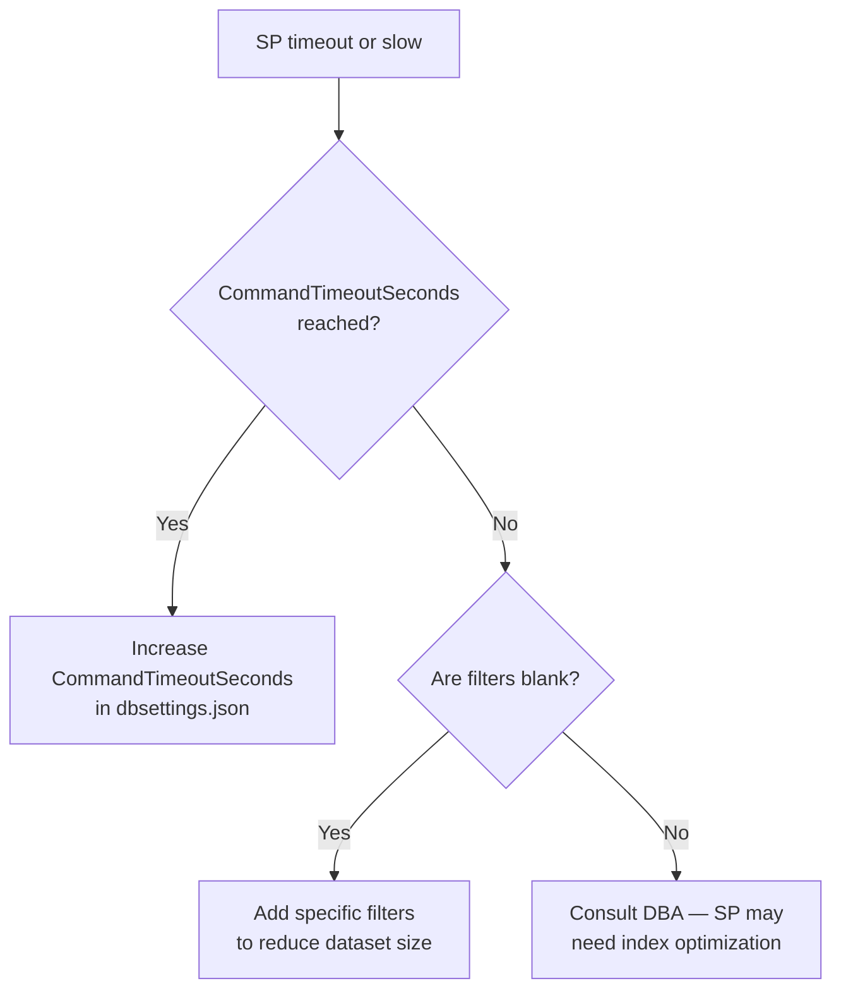

<div align="center">


# Usage Manual

**Global DataCreator ETL — v1.0.0**

*Advanced workflows, batch strategies, log analysis, and performance tuning*

</div>

---

## Table of Contents

- [Core Concepts](#core-concepts)
- [Single vs Batch Execution](#single-vs-batch-execution)
- [Batch Strategies](#batch-strategies)
- [Filter Reference & Wildcards](#filter-reference--wildcards)
- [Output File Naming Convention](#output-file-naming-convention)
- [Excel Output Deep Dive](#excel-output-deep-dive)
- [Log File Reference](#log-file-reference)
- [Reading the Execution Log](#reading-the-execution-log)
- [Configuration Tuning](#configuration-tuning)
- [Performance Tips](#performance-tips)
- [Common Workflows](#common-workflows)
- [Troubleshooting Common Issues](#troubleshooting-common-issues)
- [Error Reference](#error-reference)
- [Data Quality Notes](#data-quality-notes)
- [FAQ](#faq)

---

## Core Concepts

Understanding these fundamentals will help you use the application effectively.

### ETL Pipeline

Each extraction follows exactly this sequence:



### How SP ↔ View Works

The stored procedure **populates a temporary/staging data set**; the View then **exposes that data** for reading. This two-step design means:

1. The SP is executed first (may take seconds to minutes)
2. The row count is checked against the View
3. Data is streamed from the View into Excel

Both the SP name and View name are resolved automatically from `dbo.mst_country` — never entered manually.

### Import vs Export Mode

| Mode | SP Parameter | Typical Use |
|---|---|---|
| **Export** | `@ExpCmp` (Exporter Company) | Goods leaving the selected country |
| **Import** | `@ImpCmp` (Importer Company) | Goods entering the selected country |

The two modes use entirely different SPs and Views per country — switching mode re-resolves both automatically.

---

## Single vs Batch Execution

### Single Execution

All optional filter fields contain **zero or one** value (or are blank).

| Field | Value | Behaviour |
|---|---|---|
| HS Code | `8471` | Filters for HS 8471 only |
| Product | _(blank)_ | All products `%` |
| Port | `NHAVA` | NHAVA port only |

→ **1 file** generated.

---

### Batch Execution

**Any field with comma-separated values** triggers batch mode. The engine computes the full Cartesian product of all multi-value fields.

| Field | Values | Count |
|---|---|---|
| HS Code | `8471, 8473, 8517` | 3 |
| Port | `NHAVA, MUNDRA` | 2 |
| Product | _(blank)_ | 1 (wildcard) |

→ **3 × 2 × 1 = 6 files** generated.

**Cartesian expansion visualised:**



> 💡 **Tip:** Use batch mode sparingly for large datasets. 10 HS codes × 5 ports = 50 SP executions. Estimate time before running.

---

## Batch Strategies

### Strategy 1 — HS Code sweep

Run all HS codes in one click for a full year analysis:

```
Country:   INDIA
Mode:      Export
From:      Jan 2024    To: Dec 2024
HS Code:   8471, 8473, 8517, 8523, 8528
All others: (blank)
```

Generates 5 files — one per HS code, full year, all companies/ports.

---

### Strategy 2 — Port comparison

Compare shipment volumes across major ports for a single commodity:

```
Country:    INDIA
Mode:       Export
From:       Jan 2024    To: Jun 2024
HS Code:    8471
Port:       NHAVA SHEVA, MUNDRA, CHENNAI, BANGALORE AIR
```

Generates 4 files — same HS code, different ports. Compare Excel files side-by-side.

---

### Strategy 3 — Company-specific extraction

Pull data for specific trading companies:

```
Country:    INDIA
Mode:       Export
From:       Jan 2023    To: Dec 2023
Company:    SAMSUNG, APPLE, XIAOMI, ONEPLUS
```

Generates 4 files — one per company. Annual export data per brand.

---

### Strategy 4 — Multi-country batch (manual repeat)

Currently, each execution is for a single country at a time. For multi-country extraction:

1. Select Country A → run extraction
2. When complete, select Country B → run extraction
3. Repeat for each country

> ℹ️ Multi-country single-run batch is not currently supported. Each country has independent SP/View names requiring a separate execution.

---

### Strategy 5 — Year-over-year comparison

```
# Run 1: Prior year
From: Jan 2023    To: Dec 2023

# Run 2: Current year
From: Jan 2024    To: Dec 2024
```

With auto-naming, files will be distinguished by the month range: `INDIA_JAN23-DEC23EXP.xlsx` and `INDIA_JAN24-DEC24EXP.xlsx`.

---

## Filter Reference & Wildcards

| Filter Field | SP Param | Blank = | Exact match | Partial match |
|---|---|---|---|---|
| HS Code | `@hs` | `%` (all) | `8471` | `84%` (depends on SP) |
| Product | `@prod` | `%` (all) | `LAPTOP` | `LAP%` (depends on SP) |
| IEC Code | `@Iec` | `%` (all) | `IEC001234` | SP-dependent |
| Company | `@ExpCmp`/`@ImpCmp` | `%` (all) | `SAMSUNG INDIA` | SP-dependent |
| Foreign Country Code | `@forcount` | `%` (all) | `CN` | `C%` (depends on SP) |
| Foreign Name | `@forname` | `%` (all) | `CHINA` | SP-dependent |
| Port | `@port` | `%` (all)  | `NHAVA SHEVA` | SP-dependent |

> ⚠️ Whether partial matching with wildcards (e.g. `84%`) works depends on how each country's SP is written. Consult your DBA if unsure.

---

## Output File Naming Convention

Files are named automatically unless you provide a custom name.

### Auto-generated pattern

```
{CountryName}_{ActiveFilters}_{DateRange}{Mode}.xlsx
```

### Date range format

| Scenario | Format | Example |
|---|---|---|
| Single month | `{MON}{YY}` | `JAN24` |
| Multi-month same year | `{MON}{YY}-{MON}{YY}` | `JAN24-DEC24` |
| Cross-year | `{MON}{YY}-{MON}{YY}` | `OCT23-MAR24` |

### Mode suffix

| Mode | Suffix |
|---|---|
| Export | `EXP` |
| Import | `IMP` |

### Active filter inclusion

Filter values are included in the filename **only when not blank/wildcard**. Blank fields (all data) are omitted.

**Examples:**

| Inputs | Generated Filename |
|---|---|
| Country=INDIA, HS=8471, Jan–Dec 2024, Export | `INDIA_8471_JAN24-DEC24EXP.xlsx` |
| Country=CHINA, all blank, Jan 2024, Import | `CHINA_JAN24IMP.xlsx` |
| Country=USA, HS=8517, Port=JFK, Jan–Jun 2024, Export | `USA_8517_JFK_JAN24-JUN24EXP.xlsx` |

### Collision handling

If a file with the generated name already exists:

```
Original:  INDIA_8471_JAN24EXP.xlsx
Collision: INDIA_8471_JAN24EXP_143022.xlsx   ← HHmmss appended
```

### Custom filename

Type any name in **Excel File Name** field:
- `.xlsx` is automatically appended if not present
- Invalid path characters are replaced with `_`
- Collision handling still applies

---

## Excel Output Deep Dive

### Worksheet structure

Each generated file contains a **single worksheet** named `{CountryName} {Mode}` (max 31 characters for Excel compatibility).

```
Sheet tab: "INDIA Export"  or  "CHINA Import"
```

### Column formatting rules

The application auto-detects column types from SQL Server schema:



### Header formatting

| Attribute | Value |
|---|---|
| Font | Calibri 11pt, Bold |
| Background | Light Peach `#FCD5B4` |
| Text color | Black |
| Alignment | Center |
| Row height | 20pt |
| Top row frozen | Yes |

### Body formatting

| Attribute | Value |
|---|---|
| Font | Times New Roman 10pt |
| Text color | Black |
| Borders | Thin black on all data cells |
| Column width | Auto-fit (sampled rows to avoid slow fitting on large datasets) |
| Wrap text | Off |

### Large dataset handling

| Dataset size | Save method |
|---|---|
| ≤ 50,000 rows | Written to `MemoryStream` then flushed to disk (fast) |
| > 50,000 rows | Written directly to `FileInfo` stream (avoids out-of-memory) |
| > 1,048,575 rows | Execution **fails gracefully** with an error log entry |

> ℹ️ The 50,000-row threshold is configurable in `appsettings.json` → `LargeDatasetThreshold`.

---

## Log File Reference

Three rolling daily log files are written to `LogFilePath`:

### EXECUTION\_YYYYMMDD.txt

Records every pipeline step chronologically. Use this for **debugging** and **audit trails**.

```
10:23:41 [INF] === Execution Start ===
10:23:41 [INF] Country   : INDIA
10:23:41 [INF] Mode      : Export
10:23:41 [INF] SP        : SP_BOT_EXP_INDIA
10:23:41 [INF] View      : vw_EXP_INDIA
10:23:41 [INF] Date Range: 202401 → 202412
10:23:43 [INF] Connecting to SQL Server (Matrix,1434) — database: Process
10:23:43 [INF] Building SP parameters — target: SP_BOT_EXP_INDIA [Export mode]
10:23:43 [INF] Executing stored procedure: SP_BOT_EXP_INDIA
10:24:15 [INF] Querying row count from view: vw_EXP_INDIA
10:24:15 [INF] Building Excel workbook — 12,450 rows x 28 columns
10:24:22 [INF] File saved: INDIA_8471_JAN24-DEC24EXP.xlsx  [12,450 rows | 28 cols | 7.2s]
```

### SUCCESS\_YYYYMMDD.txt

One structured entry per successful run. Use for **run history** and **reporting**.

```
===== SUCCESS =====
Timestamp : 2024-01-15 10:24:22
Country   : INDIA
Mode      : Export
SP        : SP_BOT_EXP_INDIA
View      : vw_EXP_INDIA
From      : 202401
To        : 202412
File      : D:\Output\INDIA_8471_JAN24-DEC24EXP.xlsx
Rows      : 12,450
Duration  : 7.2s
==================
```

### ERROR\_YYYYMMDD.txt

One structured entry per failed run with full exception detail. Use for **error diagnosis**.

```
===== ERROR =====
Timestamp : 2024-01-15 10:24:22
Context   : EXECUTING_SP
Country   : INDIA
Mode      : Export
Message   : Stored procedure execution timed out after 3600 seconds
Exception : System.Data.SqlClient.SqlException: Timeout expired...
  at GlobalDataCreatorETL.Core.DataAccess.ExportDataAccess...
=================
```

### Log file rotation

| Scenario | File name |
|---|---|
| Normal day | `EXECUTION_20240115.txt` |
| Previous day | `EXECUTION_20240114.txt` |
| Multiple runs | All appended to same daily file |
| After midnight | New file created automatically |

---

## Reading the Execution Log

The on-screen log panel gives real-time visibility. Here's how to interpret a normal successful run:

| Time | Phase | Message | Meaning |
|---|---|---|---|
| 10:23:41 | `INIT` | Starting v1.0.0 | App boot |
| 10:23:41 | `DB` | Connecting to SQL Server… | Network connection attempt |
| 10:23:42 | `DB` | Connection established | DB online ✅ |
| 10:23:42 | `INIT` | Loading active countries | Reading `mst_country` |
| 10:24:05 | `BATCH` | Starting batch: 4 combinations | Multi-value expansion |
| 10:24:05 | `PREPARING` | Building SP parameters — target: SP_BOT_EXP_INDIA | Param dictionary built |
| 10:24:05 | `EXECUTING_SP` | Executing stored procedure: SP_BOT_EXP_INDIA | SP running ⏳ |
| 10:24:48 | `SP_DONE` | SP completed in 43,200ms | SP finished |
| 10:24:48 | `COUNTING` | Querying row count from view | COUNT_BIG(*) query |
| 10:24:49 | `DATA` | Schema: 28 columns detected | Column schema read |
| 10:24:49 | `GENERATING_EXCEL` | Building workbook — 12,450 rows × 28 cols | Excel in progress |
| 10:24:56 | `DONE` | File saved: INDIA_…EXP.xlsx [12,450 rows \| 28 cols \| 7.2s] | ✅ Complete |

**Interpreting timing:**

```mermaid
gantt
    title Typical ETL Run Timeline
    dateFormat  X
    axisFormat  %Ls

    section DB
    Connect          :0, 1
    section SP
    Execute SP       :1, 45
    section View
    Count rows       :45, 46
    Read schema      :46, 47
    section Excel
    Load data        :47, 53
    Format cells     :53, 55
    Save file        :55, 56
```



The longest phase is almost always **EXECUTING_SP** — the stored procedure runtime depends entirely on the database.

---

## Configuration Tuning

### For slow SP executions

If your SPs take longer than 1 hour, increase the timeout:

```json
// Config/dbsettings.json
{
  "CommandTimeoutSeconds": 7200
}
```

### For very large datasets (100k+ rows)

```json
// Config/appsettings.json
{
  "LargeDatasetThreshold": 30000
}
```

Lowering this threshold switches to direct FileStream writing sooner, reducing peak memory use.

### For unstable network connections

```json
// Config/dbsettings.json
{
  "ConnectionTimeoutSeconds": 15,
  "MonitoringIntervalMinutes": 5
}
```

Increase `ConnectionTimeoutSeconds` to give more time for initial connection on slow networks.

### For changing Excel appearance

```json
// Config/excelformatting.json
{
  "FontName": "Arial",
  "FontSize": 9,
  "HeaderBackgroundColor": "B8CCE4",
  "HeaderFontSize": 10,
  "FreezeTopRow": true,
  "AutoFitColumns": true,
  "DateFormat": "yyyy-mm-dd"
}
```

> ⚠️ Configuration changes take effect on the **next application launch**. The cache is only loaded once per session.

---

## Performance Tips

### Tip 1 — Reduce AutoFit sample rows for faster saving

AutoFit is the most CPU-intensive Excel formatting step. For large datasets, it samples only a subset of rows. The sample count is internal but can be reduced if formatting is less critical.

### Tip 2 — Use specific filters instead of wildcards for large tables

SP execution time scales with data volume. Providing a specific HS code or company name significantly reduces the result set size and execution time.

```
❌ All HS codes (blank): SP scans entire table
✅ HS code = 8471:        SP filters to ~2% of rows
```

### Tip 3 — Schedule large batch runs after hours

Batch runs with many combinations tie up the SQL Server connection. Run them during off-peak hours to avoid impacting other users.

### Tip 4 — Use SSD for output directory

Excel file saving is I/O-bound. SSD storage significantly reduces save time for large files.

### Tip 5 — Run one country at a time for parallel throughput

The application processes one combination at a time sequentially. To parallelize across countries, run multiple instances of the application with different country selections simultaneously.

---

## Common Workflows

### Workflow 1 — Monthly trade report

```
Frequency: Monthly (last day of month)
Country:   INDIA
Mode:      Export
From:      Jan 2024    To: Jan 2024
HS Code:   (blank — all HS codes)
Output:    D:\Reports\Monthly\January_2024\
```

Run this for each mode (Export then Import) to get two files per country per month.

---

### Workflow 2 — Commodity-specific analysis

```
Goal: Compare all ports for a specific HS code over a year

Country:   INDIA
HS Code:   8471
Port:      NHAVA SHEVA, MUNDRA, CHENNAI SEA, BANGALORE AIR CARGO
From:      Jan 2024    To: Dec 2024
Mode:      Export
```

Generates 4 files. Open all 4 in Excel → use Power Query to combine → pivot by port.

---

### Workflow 3 — Bilateral trade analysis

```
# Step 1: Indian exports to China
Country:            INDIA
Mode:               Export
Foreign Country:    CN

# Step 2: Indian imports from China
Country:            INDIA
Mode:               Import
Foreign Country:    CN
```

Two files: India→China exports and India←China imports. Compare in Excel.

---

### Workflow 4 — Company intelligence

```
Country:   INDIA
Mode:      Export
Company:   APPLE INDIA, SAMSUNG INDIA, XIAOMI TECHNOLOGY
From:      Jan 2024    To: Dec 2024
```

Three files — one per company. Compare export volumes, HS codes used, and destination countries.

---

## Troubleshooting Common Issues

### SP execution takes very long / times out



---

### Zero rows returned (NO_DATA phase)

**Possible causes:**

| Cause | Fix |
|---|---|
| SP parameters don't match any data | Check that the HS code / company / date range has actual records |
| SP populated staging table but View is for wrong period | Verify SP and View are aligned for the selected period |
| SP failed silently | Check SSMS; run SP manually with same parameters |

---

### Excel file is too small / missing columns

**Possible causes:**
- The View returned fewer columns than expected — check with `SELECT TOP 1 * FROM {viewName}` in SSMS
- Column schema could not be read from `INFORMATION_SCHEMA` — check user permissions on schema views

---

### Application hangs after clicking START

1. Check the Execution Log — it may be in `EXECUTING_SP` phase (SP running normally)
2. If the log shows `EXECUTING_SP` for >10 minutes with no progress: the SP is still running
3. Click **CANCEL** to send a cancellation request
4. If cancel doesn't respond, check SQL Server for blocking queries in SSMS

---

### Output directory "does not exist" validation error

```
Fix:
1. Verify the path exists: open File Explorer and navigate to it
2. Or click Browse and select an existing folder
3. Or create the folder: mkdir "D:\TradeData\Output"
```

---

## Error Reference

| Error Message | Likely Cause | Resolution |
|---|---|---|
| `Connection to SQL Server failed` | Network/auth issue | Check dbsettings.json, network, SQL Server service |
| `Stored procedure not found` | SP name resolves to non-existent object | Check `dbo.mst_country.Export_SP` for the country |
| `View not found` | View name resolves to non-existent object | Check `dbo.mst_country.Export_View` |
| `Zero rows returned` | Filters match no data | Add more specific date range or check data availability |
| `Row count exceeds MaxExcelRows` | Dataset > 1,048,575 rows | Add filters to reduce dataset, or increase time range |
| `Access to path denied` | Write permissions | Check folder permissions for the Windows user |
| `Timeout expired` | SP ran too long | Increase `CommandTimeoutSeconds`; add filters |
| `Out of memory` | Dataset too large for MemoryStream | Lower `LargeDatasetThreshold` in appsettings.json |

---

## Data Quality Notes

### Date columns

Dates are formatted as `dd-mmm-yy` (e.g. `15-Jan-24`). If you need `ISO 8601` (`2024-01-15`), change `DateFormat` in `excelformatting.json`:

```json
"DateFormat": "yyyy-mm-dd"
```

### Numeric precision

Numeric columns use `#,##0.##` — up to 2 decimal places, commas as thousands separators. For financial data requiring more precision:

```json
// Not configurable per-column yet; contact developer for custom format map
```

### Text encoding

All text is stored as Unicode (SQL Server `nvarchar`/`varchar`) and written to Excel as UTF-16. Non-Latin characters (Arabic, Chinese, Devanagari) are fully preserved.

### NULL values

SQL `NULL` values are written as empty cells in Excel. They are not converted to `0`, `"NULL"`, or any other placeholder.

---

## FAQ

**Q: Can I run multiple instances of the app simultaneously?**
A: Yes. Each instance is independent. They share the same output folder and log files (Serilog uses shared file mode). Use different output sub-folders to keep files organized.

---

**Q: Can I change the Excel worksheet name?**
A: The worksheet name is auto-generated as `{CountryName} {Mode}` (e.g. "INDIA Export"). It is not currently configurable from the UI. It can be changed in `ExcelReportService.cs` → `BuildWorksheetName()`.

---

**Q: What happens if the SQL Server goes offline mid-execution?**
A: The active `SqlCommand` will throw a `SqlException` when the connection is lost. This is caught by the orchestrator, logged to `ERROR_*.txt`, and shown in the log panel as an `[ERROR]` phase entry. The partial file is deleted. You can retry immediately once the server is back online.

---

**Q: Is there a way to schedule automatic runs?**
A: Not built in. Use Windows Task Scheduler with a command like:
```powershell
# Not available as a CLI mode yet — future feature
```

---

**Q: Can I export to CSV or other formats instead of Excel?**
A: Currently only `.xlsx` is supported. The Excel engine (EPPlus) supports CSV export — this would be a `Config/excelformatting.json` extension in a future version.

---

**Q: Where does the app store its settings between sessions?**
A: All settings are in the `Config\` folder JSON files. There is no registry usage. The last-used output folder is not persisted — it defaults from `appsettings.json` each launch.

---

**Q: How do I add a new country?**
A: Insert a row into `dbo.mst_country` with `is_active = 'Y'` and the correct computed column expressions for `Import_View`, `Export_View`, `Import_SP`, `Export_SP`. The new country will appear in the dropdown on next launch (or after **Refresh Countries** from the menu).

---

<div align="center">

For installation and setup, see the **[Installation Guide](INSTALLATION_GUIDE.md)**.

For UI navigation, see the **[User Guide](USER_GUIDE.md)**.

</div>
