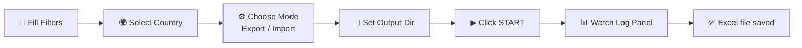
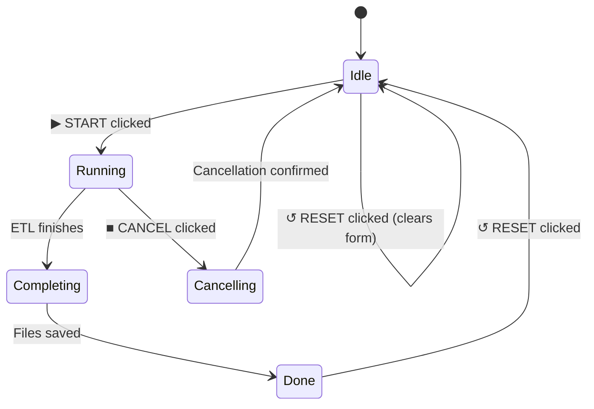
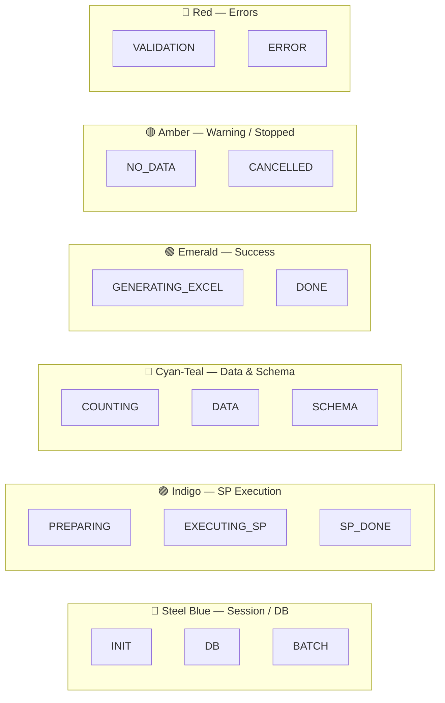
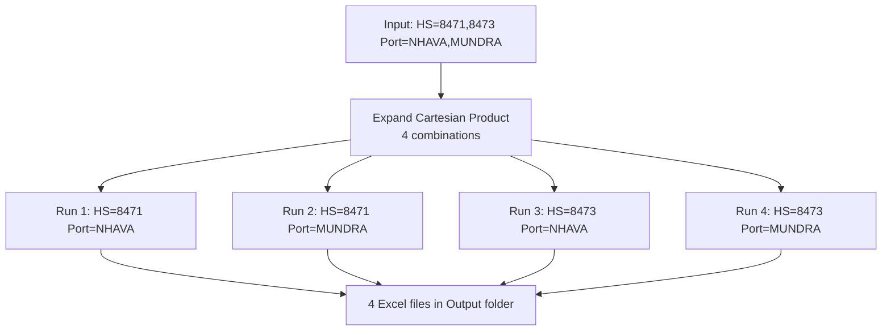

<div align="center">


# User Guide

**Global DataCreator ETL — v1.0.0**

*Learn every panel, control, and workflow of the application*

</div>

---

## Table of Contents

- [Application Overview](#application-overview)
- [Window Layout](#window-layout)
- [Custom Title Bar](#custom-title-bar)
- [Filter Parameters Panel](#filter-parameters-panel)
  - [Date Range Fields](#date-range-fields)
  - [Trade Filter Fields](#trade-filter-fields)
  - [Country & Output Fields](#country--output-fields)
- [Execution Controls Panel](#execution-controls-panel)
  - [Mode Selection](#mode-selection)
  - [View & Stored Procedure Display](#view--stored-procedure-display)
  - [Action Buttons](#action-buttons)
- [Execution Log Panel](#execution-log-panel)
  - [Status Bar](#status-bar)
  - [Log Entries](#log-entries)
  - [Phase Badge Colors](#phase-badge-colors)
- [Footer Bar](#footer-bar)
- [Running Your First Extraction](#running-your-first-extraction)
- [Understanding Batch Mode](#understanding-batch-mode)
- [Cancelling an Execution](#cancelling-an-execution)
- [Resetting the Form](#resetting-the-form)
- [Changing the Output Folder](#changing-the-output-folder)
- [Keyboard & Mouse Reference](#keyboard--mouse-reference)

---

## Application Overview

Global DataCreator ETL is a single-window desktop application. All user interaction happens within one screen, divided into four regions:

```
┌─────────────────────────────────────────────────────────────┐
│                    TITLE BAR  (Row 0)                        │
├─────────────────────────────────────────────────────────────┤
│              FILTER PARAMETERS  (Row 1)                      │
├──────────────────────────────┬──────────────────────────────┤
│                              │                              │
│    EXECUTION LOG             │   EXECUTION CONTROLS         │
│    (Row 2 · left)            │   (Row 2 · right · 420px)    │
│                              │                              │
├─────────────────────────────────────────────────────────────┤
│                    FOOTER BAR  (Row 3)                       │
└─────────────────────────────────────────────────────────────┘
```

**Workflow summary:**



---

## Window Layout

The window is **frameless** — there is no standard Windows title bar. All window management is done via the custom header at the top.

| Region | Height | Purpose |
|---|---|---|
| Title Bar | 50px | App identity, logo, minimize/maximize/close |
| Filter Parameters | ~110px | All input fields for the ETL job |
| Main Content | Remaining | Left: Execution Log · Right: Execution Controls |
| Footer | 28px | DB connection status |

The **animated cosmic background** (nebula orbs + twinkling stars + shooting stars) is always rendered behind all cards at 13% opacity — purely decorative.

---

## Custom Title Bar

```
╔═══════════════════════════════════════════════════════════════╗
║  [Logo]  Global DataCreator ETL                  [_] [□] [×] ║
║          Trade Data Extraction & Excel Generation             ║
╚═══════════════════════════════════════════════════════════════╝
```

| Action | How |
|---|---|
| **Move window** | Click-and-drag anywhere on the title bar (not on buttons) |
| **Maximize** | Double-click the title bar |
| **Restore** | Double-click the title bar again when maximized |
| **Minimize** | Click **`—`** button |
| **Maximize/Restore** | Click **`□`** button |
| **Close** | Click **`×`** button (red on hover) |

---

## Filter Parameters Panel

```
╔══════════════════════════════════════════════════════════════╗
║  🔽 FILTER PARAMETERS                                        ║
║  Date range, trade filters & output configuration            ║
╠══════════════════════════════════════════════════════════════╣
║  From: [Jan ▼][2024]  To: [Dec▼][2024]   HS Code: [      ] ║
║────────────────────────────────────────────────────────────║
║  Product: [       ]  IEC Code: [       ]  Company: [      ] ║
║────────────────────────────────────────────────────────────║
║  Fgn CC:  [       ]  Fgn Name: [       ]  Port:    [      ] ║
║────────────────────────────────────────────────────────────║
║  Country: [          ▼]  File Name: [           ]           ║
║  Output:  [                                  ][Browse]       ║
╚══════════════════════════════════════════════════════════════╝
```

### Date Range Fields

The date range defines the period for which trade data is extracted.

| Field | Type | Notes |
|---|---|---|
| **From Month** | Dropdown | January – December (1–12) |
| **From Year** | Text box | 4-digit year, e.g. `2024` |
| **To Month** | Dropdown | January – December (1–12) |
| **To Year** | Text box | 4-digit year, e.g. `2024` |

> ⚠️ From date must be **≤** To date. Validation will block execution if this is violated.

**Examples:**

| Scenario | From | To | Result |
|---|---|---|---|
| Single month | Jan 2024 | Jan 2024 | January 2024 only |
| Full year | Jan 2024 | Dec 2024 | All of 2024 |
| Quarter | Apr 2024 | Jun 2024 | Q2 2024 |
| Cross-year | Oct 2023 | Mar 2024 | Oct 2023 → Mar 2024 |

---

### Trade Filter Fields

All trade filter fields are **optional**. Leaving a field blank is equivalent to `%` (match all). Multiple values can be entered **comma-separated** to trigger batch mode.

| Field | SP Parameter | Example Value | Notes |
|---|---|---|---|
| **HS Code** | `@hs` | `8471` or `8471, 8473` | Harmonized System commodity code |
| **Product** | `@prod` | `LAPTOP` | Product description |
| **IEC Code** | `@Iec` | `IEC001` | Importer/Exporter Code |
| **Company** | `@ExpCmp` or `@ImpCmp` | `ACME CORP` | Dynamic label changes with mode |
| **Foreign Country Code** | `@forcount` | `CN` or `US, CN, DE` | ISO country code of trading partner |
| **Foreign Name** | `@forname` | `CHINA` | Trading partner country name |
| **Port** | `@port` | `NHAVA SHEVA` | Port of shipment or entry |

> 💡 **Comma-separated values** in any field create a batch — the ETL runs once per value combination. See [Understanding Batch Mode](#understanding-batch-mode).

> 💡 The **Company** label dynamically changes between **"Exporter Company"** (Export mode) and **"Importer Company"** (Import mode).

---

### Country & Output Fields

| Field | Notes |
|---|---|
| **Country** | Dropdown populated from `dbo.mst_country WHERE is_active = 'Y'`. Selecting a country automatically resolves the View and Stored Procedure names. |
| **Excel File Name** | Optional. Leave blank for auto-generated name (`Country_Filters_MonthRangeEXP.xlsx`). If provided, `.xlsx` is appended automatically. |
| **Output Directory** | Path where Excel files are saved. Pre-filled from `appsettings.json`. Can be changed via **Browse** or by typing. |

**Auto-generated filename examples:**

| Country | HS Code | Date Range | Mode | Generated Name |
|---|---|---|---|---|
| INDIA | 8471 | Jan–Dec 2024 | Export | `INDIA_8471_JAN24-DEC24EXP.xlsx` |
| CHINA | (blank) | Jan 2024 | Import | `CHINA_JAN24IMP.xlsx` |
| USA | 8517 | Apr–Jun 2024 | Export | `USA_8517_APR24-JUN24EXP.xlsx` |

If a file with the generated name already exists, a timestamp suffix `_HHmmss` is appended to prevent overwrites.

---

## Execution Controls Panel

```
╔═══════════════════════════════╗
║  ⚙ EXECUTION CONTROLS        ║
║  ETL Operation Manager        ║
╠═══════════════════════════════╣
║  Mode:  ◉ Export  ○ Import   ║
║                               ║
║  VIEW                         ║
║  ┌─────────────────────────┐  ║
║  │ vw_EXP_INDIA            │  ║
║  └─────────────────────────┘  ║
║  STORED PROCEDURE             ║
║  ┌─────────────────────────┐  ║
║  │ SP_BOT_EXP_INDIA        │  ║
║  └─────────────────────────┘  ║
╠═══════════════════════════════╣
║  [  ▶  START  ]               ║
║  [  ■  CANCEL ]               ║
║  [  ↺  RESET  ]               ║
╚═══════════════════════════════╝
```

### Mode Selection

| Radio | Description |
|---|---|
| **◉ Export** | Runs the Export stored procedure and queries the Export view (`Export_SP`, `Export_View` from `mst_country`) |
| **○ Import** | Runs the Import stored procedure and queries the Import view (`Import_SP`, `Import_View` from `mst_country`) |

Switching mode immediately updates the **VIEW** and **STORED PROCEDURE** display fields below.

---

### View & Stored Procedure Display

These are **read-only** fields — they show the names resolved automatically from `dbo.mst_country` for the selected country and mode combination.

| Field | Source Column | Example Value |
|---|---|---|
| **VIEW** | `Export_View` or `Import_View` | `vw_EXP_INDIA` |
| **STORED PROCEDURE** | `Export_SP` or `Import_SP` | `SP_BOT_EXP_INDIA` |

> ℹ️ If these fields show empty values, the selected country may not have its metadata configured in `dbo.mst_country`. Contact your database administrator.

---

### Action Buttons

| Button | Color | Active When | Action |
|---|---|---|---|
| **▶ START** | Green | Not running | Validates inputs and begins ETL execution |
| **■ CANCEL** | Red | Running only | Requests graceful cancellation; partial files are deleted |
| **↺ RESET** | Purple | Always | Clears all filter fields and log entries; returns to Idle state |

**Button states:**



---

## Execution Log Panel

```
╔══════════════════════════════════════════════════════╗
║  ⚡ EXECUTION LOG            [INDIA] [vw_EXP_INDIA]  ║
╠══════════════════════════════════════════════════════╣
║  ● Processing  ·  EXECUTING_SP  ·  00:00:08   1,240 ║
║  ████████████████████████░░░░░░░░░░░░░░░░░  (busy)  ║
╠══════════════════════════════════════════════════════╣
║  TIME    │  STAGE          │  DETAILS                ║
╠══════════════════════════════════════════════════════╣
║  10:23   │ [INIT      ]    │  Starting v1.0.0        ║
║  10:23   │ [DB        ]    │  Connecting to server…  ║
║  10:23   │ [DB        ]    │  Connection established ║
║  10:23   │ [INIT      ]    │  Loading countries…     ║
║  10:24   │ [PREPARING ]    │  Building SP params     ║
║  10:24   │ [EXECUTING_SP]  │  Executing SP_BOT…      ║
╚══════════════════════════════════════════════════════╝
```

### Status Bar

The status bar (above the log list) gives a live summary:

| Element | Description |
|---|---|
| **Coloured dot** | Green = Processing, Red = Error, Amber = Idle/Cancelled, Blue = Done |
| **Status message** | Human-readable current state |
| **Phase chip** | Current pipeline phase name |
| **Elapsed timer** | Time since execution started (updates every second) |
| **Row counter** | Number of data rows retrieved so far |

### Log Entries

Each log row has three columns:

| Column | Width | Content |
|---|---|---|
| **TIME** | ~55px | `HH:mm` timestamp when the event occurred |
| **STAGE** | ~100px | Phase badge (coloured pill) |
| **DETAILS** | Remaining | Full message — no truncation, wraps if long |

The log scrolls automatically as new entries arrive. All text wraps — no messages are cut off.

---

### Phase Badge Colors



---

## Footer Bar

```
 [Logo]  © 2026 Global DataCreator ETL  v1.0.0     ●  Matrix,1434  |  Process  |  Connected (42ms)
```

| Element | Description |
|---|---|
| **Mini logo** | Brand logo at 18×18 — clickable area (reserved for future use) |
| **Copyright** | App name and version |
| **Status dot** | 🟢 Green = connected · 🔴 Red = disconnected |
| **Server** | SQL Server hostname and port from config |
| **Database** | Target database name |
| **Status message** | "Connected (42ms)" with live response time · "Disconnected" if unreachable |

The DB health status is checked:
- At startup
- Every `MonitoringIntervalMinutes` minutes in the background
- Monitoring is **paused** during SP execution to avoid interfering with the connection pool

---

## Running Your First Extraction

Follow these steps for a clean first run:

**Step 1 — Confirm connection**

Check the footer. The dot must be green and show "Connected".

**Step 2 — Select a country**

Click the **Country** dropdown and choose any available country.

**Step 3 — Verify View and SP resolved**

In the Execution Controls panel, confirm both **VIEW** and **STORED PROCEDURE** fields show non-empty values.

**Step 4 — Set the date range**

Set **From** = January 2024 and **To** = January 2024 for a quick single-month test.

**Step 5 — Leave all trade filters blank**

Blank fields default to `%` (match all) — this returns the full dataset.

**Step 6 — Verify the output directory**

Ensure the **Output Directory** path exists. Click **Browse** to choose a folder if needed.

**Step 7 — Click START**

Watch the Execution Log panel. Phases should progress:

```
INIT → DB → PREPARING → EXECUTING_SP → SP_DONE → COUNTING → DATA/SCHEMA → GENERATING_EXCEL → DONE
```

**Step 8 — Check the output**

When `[DONE]` appears, click **Open Output Folder** (from the menu, or navigate manually) to find your `.xlsx` file.

---

## Understanding Batch Mode

When **any filter field contains comma-separated values**, the ETL engine expands them into a Cartesian batch — every combination of values is run as a separate pipeline execution.

```
HS Code:     8471, 8473          → 2 values
Port:        NHAVA, MUNDRA       → 2 values
All others:  (blank)             → 1 value each

Total combinations: 2 × 2 × 1 = 4 files
```

**Batch execution flow:**



**Each file gets a unique auto-generated name** that includes its specific filter values:

```
INDIA_8471_NHAVA_JAN24EXP.xlsx
INDIA_8471_MUNDRA_JAN24EXP.xlsx
INDIA_8473_NHAVA_JAN24EXP.xlsx
INDIA_8473_MUNDRA_JAN24EXP.xlsx
```

> ⚠️ Batch mode can generate many files and take significant time. Estimate: `combinations × avg_execution_time_per_SP`. Use **CANCEL** at any time to stop.

---

## Cancelling an Execution

1. Click **■ CANCEL** during any active execution
2. The pipeline will complete the **current step** it is on (you cannot interrupt mid-SP)
3. Any partial Excel file that was being written is **automatically deleted**
4. The log panel shows `[CANCELLED]` badge
5. The status dot turns amber

> ⚠️ Cancellation is **cooperative** — the current database command (if running) must complete or timeout before cancellation takes effect. For long-running SPs, this may take time.

---

## Resetting the Form

Click **↺ RESET** at any time (even during a paused/idle state) to:

- Clear all trade filter fields (HS Code, Product, IEC, Company, Foreign CC, Foreign Name, Port)
- Clear the Excel File Name field
- Clear the Execution Log entries
- Reset the status bar to Idle
- Reset the elapsed timer

> ℹ️ Reset does **not** change the selected Country, Mode, date range, or Output Directory — these are considered "session settings" you set once.

---

## Changing the Output Folder

**Method 1 — Browse button:**
Click **Browse** next to the Output Directory field. A folder picker dialog opens. Navigate to your desired folder and click **Select Folder**.

**Method 2 — Type directly:**
Click inside the Output Directory field and type or paste a folder path. The path is used as-is; the ETL will fail gracefully if the path does not exist at execution time.

**Method 3 — Change the default:**
Edit `Config\appsettings.json` and update `"OutputFilePath"`. The new path is used on the next application launch.

---

## Keyboard & Mouse Reference

| Action | Input |
|---|---|
| Move window | Click-drag on title bar |
| Maximize / Restore | Double-click title bar |
| Navigate fields | `Tab` / `Shift+Tab` |
| Open dropdown | `Alt+Down` or click |
| Select dropdown item | Arrow keys + `Enter` |
| Clear a text field | `Ctrl+A` then `Delete` |
| Submit (Start) | Click **▶ START** (no keyboard shortcut) |
| Scroll log list | Mouse wheel over log panel |

---

<div align="center">

For advanced scenarios — batch strategies, performance tuning, log file analysis — see the **[Usage Manual](USAGE_MANUAL.md)**.

For setup and configuration, see the **[Installation Guide](INSTALLATION_GUIDE.md)**.

</div>
